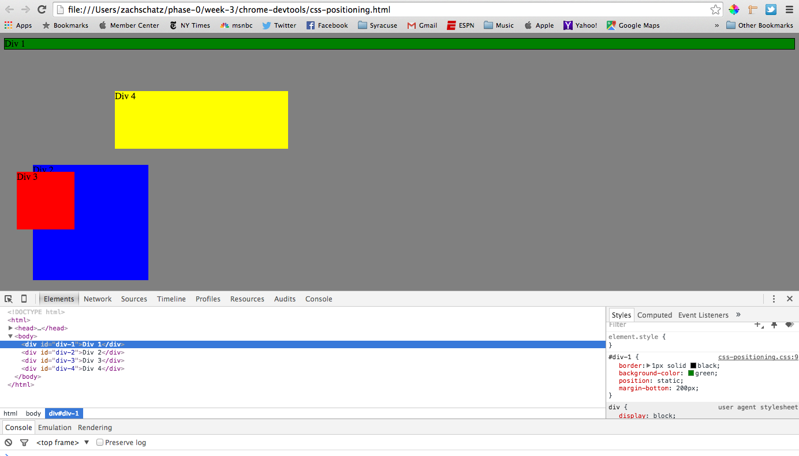
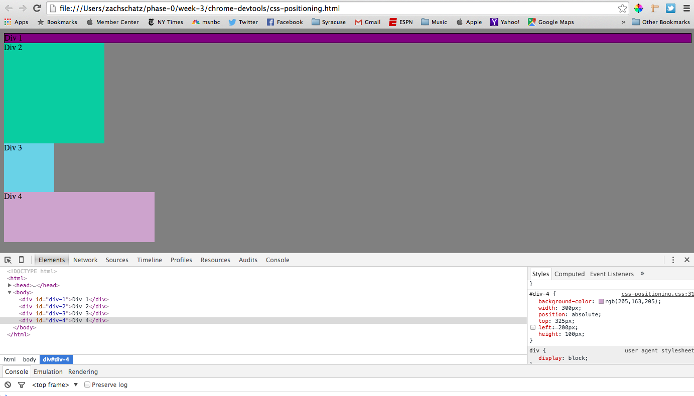
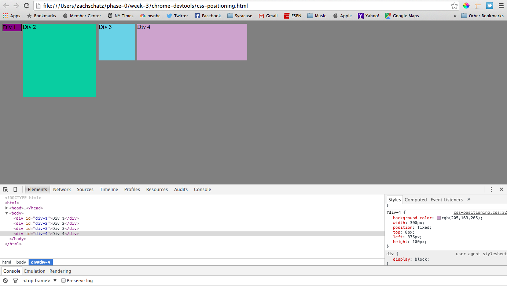
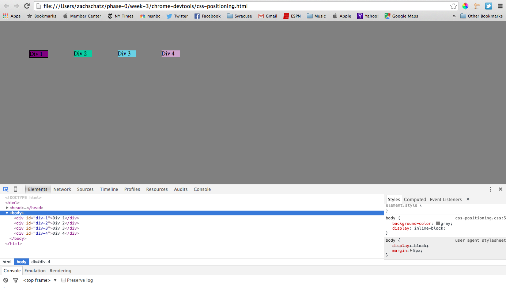
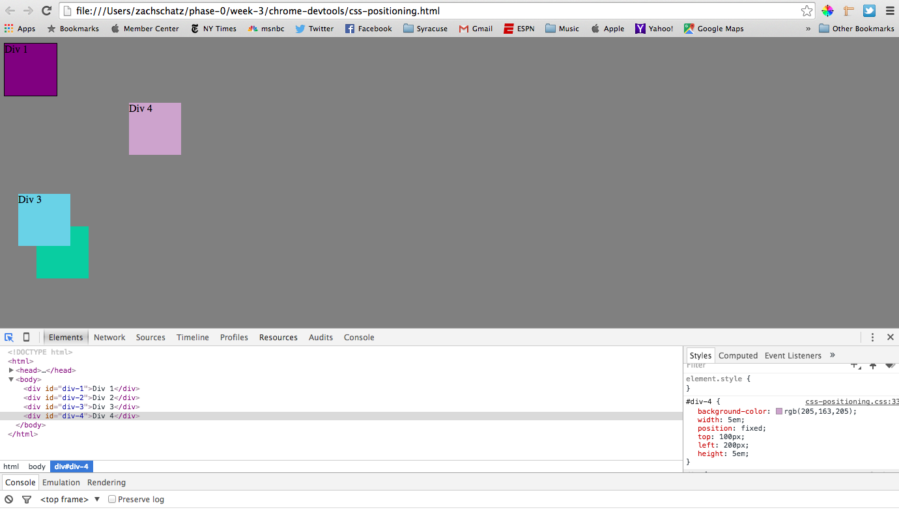
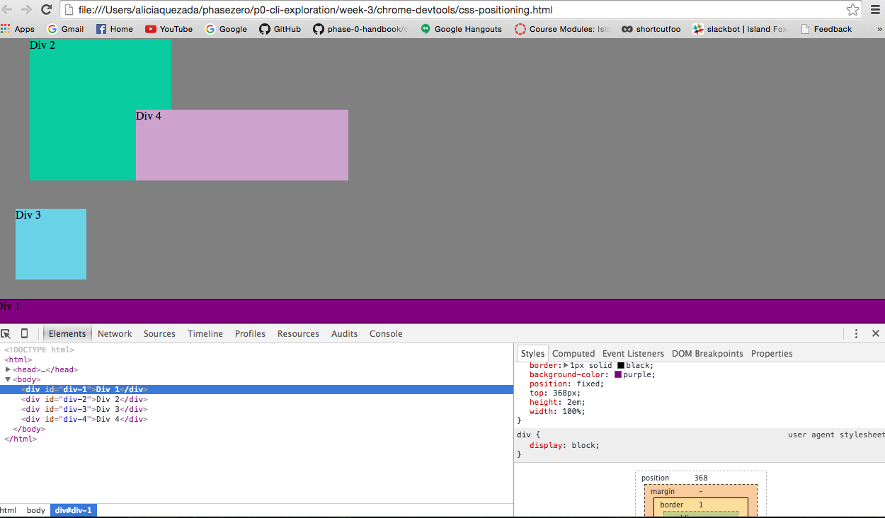
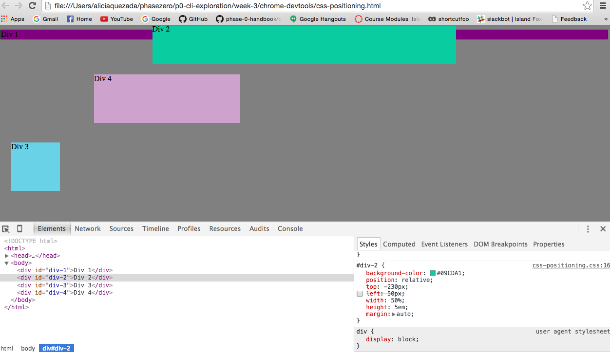
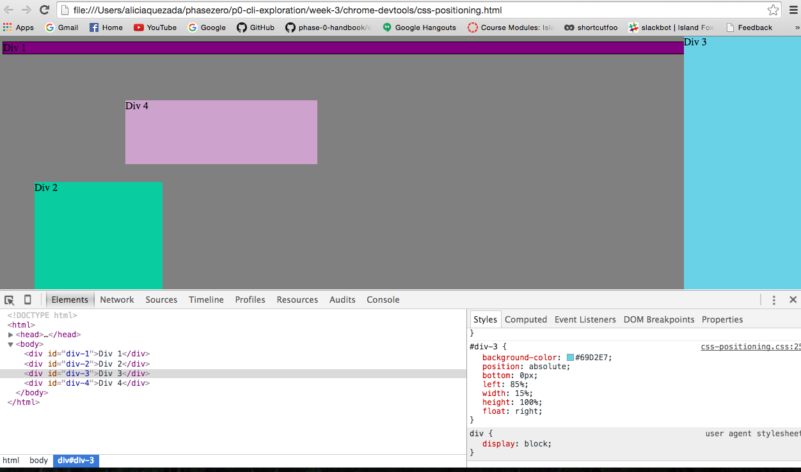
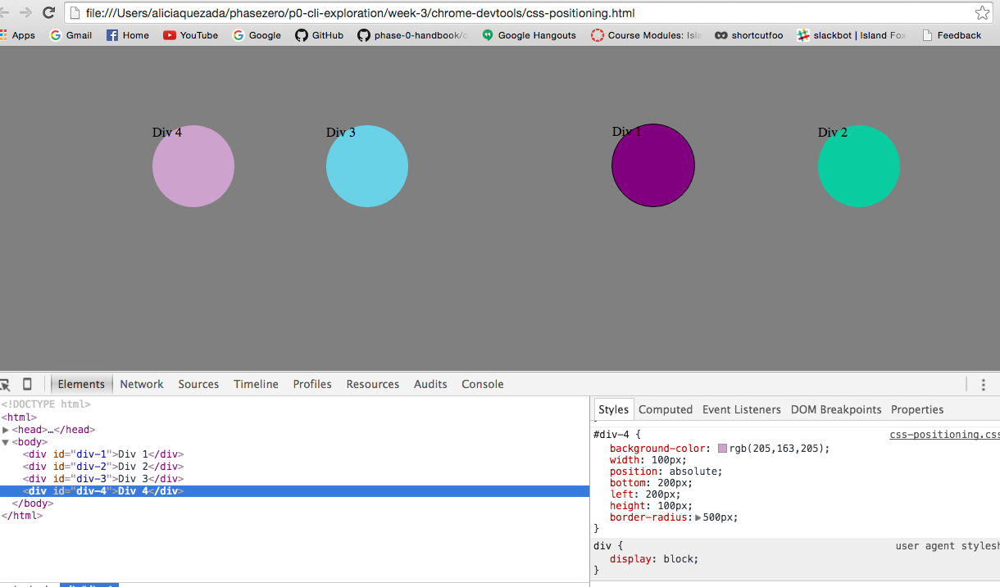

Reflection Q&A

How can you use Chrome's DevTools inspector to help you format or position elements?

Chrome's DevTools inspector can be used as a quick reference to alter format and positioning on a webpage without going through the steps of editing and saving the actual CSS file. Chrome's DevTools allows of quick changes to the code, and immediately reflects the edits in the webpage view. During the challenge, we were able to manipulate element sizes and positions to test for changes on the page. If we were editing a stylesheet, we'd be able to take those changes and apply it to the code once proven correct in the inspector environment.

How can you resize elements on the DOM using CSS?

Resizing elelments in the DOM takes place in the elements tab of the DevTools inspector. From there, you are able to edit the style of a selected element - including size. The current size will be displayed and can then be changed. This includes the width and height of a given element.

What are the differences between Absolute, Fixed, Static, and Relative positioning? Which did you find easiest to use? Which was most difficult?

Absolute - position relative to the nearest positioned ancestor
Fixed - position always stays at the same place even if the page is bring scrolled. Top, right, bottom and left properties are used to position the element.
Static - elements are positioned by default and not affected by the top, bottom, left and right properties
Relative - elements positioned relative to its normal position. Setting the top, bottom, right and left properties causes adjustment away from normal psoition. This does not affect other content on the page.

I find that relative and absolute are the easiest to use. They seem to be the most basic practices to arrange a page. On the other hand, static seems to be difficult to use since it is not affected by the top, bottom, right and let properites.

What are the differences between Margin, Border, and Padding?

Margin - Space around an element
Border - Edge of an element
Padding - Area inside an element

What was your impression of this challenge overall? (love, hate, and why?)

I enjoyed it, but we fell into a few rabbit holes along the way. We quickly realized that we were going around in circles and needed to take a step back. I feel as though we both could have used a bit of practice with positioning properties prior to working together. There was a decent amount of research, which we had to adjust to on the fly. Overall, I felt as though the challenge was a good demonstration of the positioning properties.
