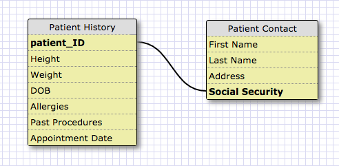
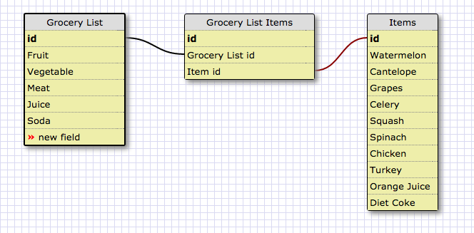

The above schema is an example of a doctor database organizing patient information. There is a one-to-one relationship between patient ID and social security number. This exemplifies a one-to-one relationship as both are unique to each individual patient. These cannot be shared across patients in the same way that multiple patients may have the same height and/or weight. These are both primary keys directly related to one another.

Release 6: Reflect

What is a one-to-one database?

I already touched on this earlier in the challenge, but it's essentially the connection between two tables through unique data points. These are primary keys that relate to one another. It demonstrates a pair that can only occur once. In my example, the pair is between the patient_id and the patient's social security number. Each patient can only have one of each.

When would you use a one-to-one database? (Think generally, not in terms of the example you created).

One-to-one databases would be used whenever we have a unique pair of attributes. These can only occur once. For example, a list of usernames and passwords. Each username can only be created once, and each username can only be attached to a singular password. This password can always be changed, but the number of passwords per username will never exceed one.

What is a many-to-many database?

Many-to-many databases are sets of data in which many attributes are correlated to another. This is useful while creating lists, and categorizing large quantities of data. We are then able to categorize data and sort by many points being attached to others.

When would you use a many-to-many database? (Think generally, not in terms of the example you created).

When you want to join two sets of tables, you would use many-to-many databases. We can go about creating multiple tables, but bringing them together would require many-to-many relationships.

What is confusing about database schemas? What makes sense?

I'm continuing research to further my understanding on the different types of databases. I understand the creation of schemas, and its purpose towards organization, but haven't seen it incorporated into the work we've done so far in phase-0. The relationships can become complex when layering on one-to-many and many-to-many in the same schema. The rooms of art is a good example, but beyond that I can't visualize one on my own yet.

